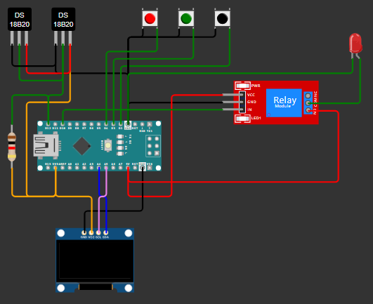

# Arduino Temp Controller

## Descrição

Este projeto é um controlador de temperatura desenvolvido com Arduino Nano. Ele utiliza um sensor de temperatura DS18B20, um display OLED 128x64, um módulo relé de 5V e três botões táticos para monitorar e ajustar a temperatura de um freezer vertical. A temperatura mínima e máxima podem ser configuradas pelo usuário, e o sistema controla um relé que ativa ou desativa o compressor do freezer para manter a temperatura dentro do intervalo desejado. Este projeto, pode ser adaptado para outros sistemas que requer um controle de temperatura em uma determinado intervalo.

## Componentes

- 1 Arduino Nano
- 1 ou mais sensores de temperatura DS18B20
- 1 Módulo Relé 5V
- 1 Display OLED I2C 128x64
- 3 Botões táticos
- Resistores de 4.7kΩ para pull-up
- Fonte de alimentação (por exemplo, um carregador de celular)

## Esquema Elétrico

## Instruções de Montagem

1. **Conexão do Sensor DS18B20:**
   - Conecte o pino de dados do DS18B20 ao pino digital D11 do Arduino Nano.
   - Conecte o resistor de 4.7kΩ entre o pino de dados e o VCC do DS18B20.
   - Conecte o VCC do DS18B20 ao 5V do Arduino Nano.
   - Conecte o GND do DS18B20 ao GND do Arduino Nano.

2. **Conexão do Display OLED:**
   - Conecte o SDA do display OLED ao pino A4 do Arduino Nano.
   - Conecte o SCL do display OLED ao pino A5 do Arduino Nano.
   - Conecte o VCC do display OLED ao 5V do Arduino Nano.
   - Conecte o GND do display OLED ao GND do Arduino Nano.

3. **Conexão do Módulo Relé:**
   - Conecte o sinal de controle do relé ao pino digital D13 do Arduino Nano.
   - Conecte o VCC do módulo relé ao 5V do Arduino Nano.
   - Conecte o GND do módulo relé ao GND do Arduino Nano.

4. **Conexão dos Botões Táticos:**
   - Conecte um terminal do botão de ajuste ao GND.
   - Conecte o outro terminal do botão de ajuste aos pinos digitais D2 (UP), D3 (SET) e D4 (DOWN) do Arduino Nano.

5. **Alimentação:**
   - Conecte o Arduino Nano a uma fonte de alimentação, como um carregador de celular, através do conector USB ou do pino Vin.

## Licença

Este projeto está licenciado sob a Licença MIT. Veja o arquivo `LICENSE` para mais detalhes.
