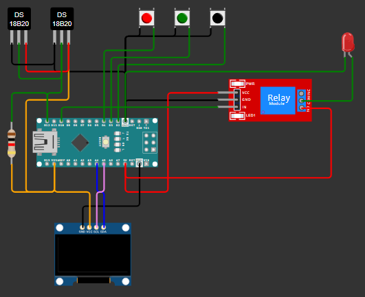

# Arduino Temp Controller

## Description

This project is a temperature controller developed with Arduino Nano. It uses a DS18B20 temperature sensor, a 128x64 OLED display, a 5V relay module, and three tactile buttons to monitor and adjust the temperature of a vertical freezer. The minimum and maximum temperatures can be configured by the user, and the system controls a relay that activates or deactivates the freezer's compressor to maintain the temperature within the desired range.

## Components

- 1 Arduino Nano
- 1 or more DS18B20 temperature sensors
- 1 5V Relay Module
- 1 OLED I2C 128x64 Display
- 3 Tactile Buttons
- 4.7kΩ pull-up resistors
- Power supply (e.g., a cell phone charger)

## Circuit Diagram

## Assembly Instructions

1. **Connecting the DS18B20 Sensor:**
   - Connect the DS18B20 data pin to digital pin D11 on the Arduino Nano.
   - Connect the 4.7kΩ resistor between the data pin and the DS18B20 VCC.
   - Connect the DS18B20 VCC to the Arduino Nano's 5V.
   - Connect the DS18B20 GND to the Arduino Nano's GND.

2. **Connecting the OLED Display:**
   - Connect the OLED display SDA to Arduino Nano's A4 pin.
   - Connect the OLED display SCL to Arduino Nano's A5 pin.
   - Connect the OLED display VCC to Arduino Nano's 5V.
   - Connect the OLED display GND to Arduino Nano's GND.

3. **Connecting the Relay Module:**
   - Connect the relay control signal to Arduino Nano's digital pin D13.
   - Connect the relay module VCC to Arduino Nano's 5V.
   - Connect the relay module GND to Arduino Nano's GND.

4. **Connecting the Tactile Buttons:**
   - Connect one terminal of each adjustment button to GND.
   - Connect the other terminal of the adjustment buttons to Arduino Nano's digital pins D2 (UP), D3 (SET), and D4 (DOWN).

5. **Power Supply:**
   - Connect the Arduino Nano to a power source, such as a cell phone charger, via the USB connector or Vin pin.

## License

This project is licensed under the MIT License. See the `LICENSE` file for more details.
